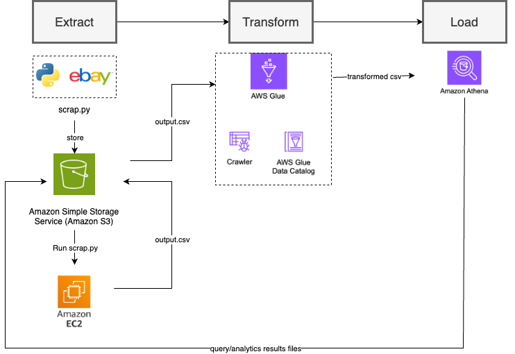

# ETL Data Pipelines in AWS

- Author: Amelia Tang

This is the GitHub repository to document various ETL data pipelines I designed using AWS. 

## What is ETL?
Extract, Transform and Load (ETL) us a fundamental framework for streamlining data processing workflows. ETL pipelines facilitate the efficient extraction of data from diverse sources, transformation into a usable format, and loading into designated destinations for analysis.

#### Extract 
Run a Python web scrapping file stored in an S3 bucket on an EC2 instance and save the output csv file to the S3 bucket

#### Transform 
Manipulate and transform the output csv file using AWS Glue

#### Load 
Load the data to AWS Athena for query and analysis and save the result files to an S3 bucket 

## ETL Diagrams
#### Project 1
Extra public listing data from eBay.com using the Python script, transformed the data in AWS Glue and load the transformed data to AWS Athena for further analysis  

## ETL Data Pipeline Implementation on AWS  
To demonstrate the implementation of the ETL data pipelines on AWS, I have created blog posts on Medium.com to document the process.
#### Project 1
- Extract: [Run a Python Script Stored in S3 on EC2](https://medium.com/@aimee.tang0317/beginners-guide-to-aws-how-to-run-a-python-script-stored-in-s3-on-ec2-f05730c500e7)
- Transformation & Load: [How to Create a Powerful ETL Data Pipeline with Python and AWS Services](https://medium.com/@aimee.tang0317/how-to-create-a-powerful-etl-data-pipeline-with-python-and-aws-services-6ad8ddd7ca1b)
